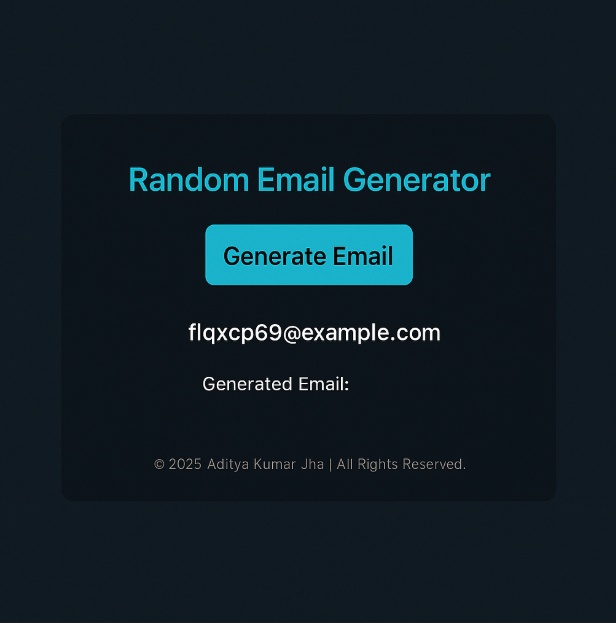

# Random Email Generator


## Tech Stack: 
[](https://www.python.org)
[](https://flask.palletsprojects.com/en/stable/)
[](https://developer.mozilla.org/en-US/docs/Web/HTML)
[](https://developer.mozilla.org/en-US/docs/Web/CSS)

<br>

## Features:

- Generates a random email each time you click a button
- Clean, responsive webpage
- Copyright in the footer

<br>
<br>

## Preview:



<br>
<br>

## Folder Structure
```
random_email_generator/
│
├── app.py
├── templates/
│   ├── index.html
├── static/
│   ├── style.css
└── README.md
```

<br>
<br>

# Random Email Generator Website

This is a simple Flask web app that generates a random email address at the click of a button.


<br>
<br>

## How to Run

**Clone the repository**
```
   git clone https://github.com/technical-aditya-rathore/Random-Email-Generator-Flask.git
   cd Random-Email-Generator-Flask
   pip install flask

```

And go to this route on your browser or check your terminal logs : `http://127.0.0.1:5000`
   
<br>
<br>

© 2025 Aditya Kumar Jha. All Rights Reserved.  

This project, “Random Email Generator”, including all source code, design, and content, is protected under applicable copyright laws. Unauthorized reproduction, distribution, or use of any part of this project without express written permission is strictly prohibited.

